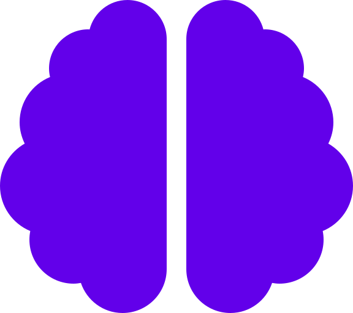

<div align="center">
  
  <h1>CTF: Brainrot Edition</h1>
</div>

> "Prepare to debug the un-debuggable and decrypt the absurd."

Welcome to **CTF: Brainrot Edition**, a chaotic, meme-filled, and surprisingly intellectual Capture The Flag challenge built with React. Navigate through a series of cryptic levels, solve riddles, inspect source code, decode signals, and prove your brain hasn't completely rotted away.

## 🚀 Levels

The game consists of 7 progressive levels (and potentially more coming soon). You must solve the current level to unlock the next one.

1.  **Level 1: Last Commit**
2.  **Level 2: The Circle Never Ends**
3.  **Level 3: Strongest Wills**
4.  **Level 4: The Dark Knight**
5.  **Level 5: The Ultimate Answer**
6.  **Level 6: The Mathematical Truth**
7.  **Level 7: The Signal** 📡

## 🔒 Security Features

- **Progressive Unlocking**: Access to future levels is strictly restricted until you solve the previous one.
- **Anti-Cheat System**: We use a `SHA-256` token-based verification system stored in `localStorage` to prevent simple value editing.
- **Environment Variables**: Secrets are kept safe in `.env` (mostly).
- **Steganography & Metadata**: Hidden clues in image files and logs.

## 🛠️ Tech Stack

- **Frontend Framework**: [React](https://reactjs.org/) + [Vite](https://vitejs.dev/)
- **Styling**: [Material UI (MUI)](https://mui.com/) + Custom CSS
- **Animations**: [Framer Motion](https://www.framer.com/motion/)
- **Icons**: [React Icons](https://react-icons.github.io/react-icons/)
- **Notifications**: [React Hot Toast](https://react-hot-toast.com/)

## 🎮 How to Play

1.  **Start the Challenge**: Click the button on the home page.
2.  **Find the Flag**: Flags are hidden in the UI, source code, console logs, network requests, downloadables (images/logs), external links, or environmental variables.
    - Format: `flag{some_text}` (in code) but usually you just submit the `some_text` part.
    - **Inputs are case-insensitive.**
    - Spaces are automatically converted to underscores on submission.
3.  **Submit**: Enter the flag contents (e.g., `some_text`) into the submission box.
4.  **Advance**: Solving a level grants you a security token to access the next route.

**Stuck?** Look for the `?` icon in the top right corner for general rules.

## 💻 Installation & Run

1.  **Clone the repository**

    ```bash
    git clone https://github.com/sonalsai/CTF-Brainrot-Edition.git
    cd CTF-Brainrot-Edition
    ```

2.  **Install dependencies**

    ```bash
    npm install
    ```

3.  **Set up environment variables**
    Create a `.env` file in the root directory (references provided in code, you'll figure it out 😉).
    - `VITE_FLAG1`: Flag for Level 1
    - ...
    - `VITE_FLAG7`: Flag for Level 7
    - `VITE_SECURITY_SALT`: Salt for hash generation

4.  **Start the development server**
    ```bash
    npm run dev
    ```

## ⚠️ Disclaimer

This project is for educational and entertainment purposes only. The "security" implemented here is client-side and meant for a CTF context—do not use this authentication logic for real banking apps. Please.

---

_Made with ❤️ and too much caffeine by [Sonal Sai](https://github.com/sonalsai)_
